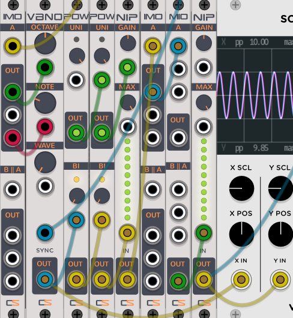

# Captain's Sounds VCV Rack Modules

 

Modules are for [VCV Rack](https://vcvrack.com), an open-source, virtual Eurorack-style modular synthesizer.

All modules are available for free in the [VCV Rack library](https://captainssounds.com/vcv).

## Modules

- [Blanks](#blanks)
- [Filters](#filters)
- [Limiters](#limiters)
- [Multipliers](#mults)
- [Oscillators](#osc)
- [Utilities](#utils)

###  Blanks 

#### Blank901
A 1 HP Blank with the 9Oh theme and Captain's Sounds icon

#### Blank902
A 2 HP Blank with the 9Oh theme

#### Blank904
A 4 HP Blank with the 9Oh theme

#### Blank908
An 8 HP Blank with the 9Oh theme

###  Filters

#### Dip
Parallel High-Pass, Low-Pass Huovilainen Moog style 4-stage ladder filter

###  Limiters

#### Nip
Polyphonic Hard clipper/limiter with ceiling

###  Multipliers 

#### IMO - Input to Multiple Output
Dual polyphonic input to multi out

#### MIO - Multiple Input to Output
Dual polyphonic multi input to out

###  Oscillators

#### VBNO - Voice By Note Oscillator
Oscillator with locked pitch by octave & note. Also allows for v/oct overrides rounding voltage to nearest octave or note.

###  Utilities

#### DBug
(Currently Unavailable in Rack 2.0)
Debug expander allowing for simple debugging from any module for any developer!

[How to setup DBug for your own plugins](https://github.com/captainssounds/vcv-CaptainsSounds/wiki/How-to-setup-your-plugins-to-use-DBug)

#### Pow
Polyphonic Uni-polar and Bi-polar voltage generator and attenuator

## License

All source code is licensed under the [GNU General Public License v3.0](https://www.gnu.org/licenses/gpl-3.0.txt).

## Documentation

Right now, I'm more focused on music creation and module creation. I'm trying to make my modules' functions obvious through name, description and type. If something isn't self obvious, shoot me an email or file an issue. If you're dying to write up documentation, let's get together and make it happen.

## Design

Right now, this is a one-man, open-source shop. I'm a developer by nature, and my designs are utilitarian at best. If you're interested in assisting with the graphic design, I'd love to see what you have in mind. 

## Issues and Feedback

Bug reports and feedback are welcome: please use the [issue tracker](https://github.com/captainssounds/vcv-CaptainsSounds/issues).

## Acknowledgements

The Github Actions auto-build scripts under [.github/](.github) are originally from [SubmarineFree](https://github.com/david-c14/SubmarineFree) -- thanks @david-c14 and @dewb -- find a detailed explanation [here](https://github.com/david-c14/SubmarineFree/wiki/Cross-compiling-using-github-actions).

The Moog Ladder filter dependency is provided by @ddiakopoulos under "The Unlicense" license. The original source code can be found [here](https://github.com/ddiakopoulos/MoogLadders).

Special thanks to [curlymorphic](https://github.com/curlymorphic) for finally resolving the pesky crashes caused by DBug and some 3rd party modules

## Financial support and sponsorship
All donations are extremely appreciated.
Please visit [captainofbass.com/donate](https://captainofbass.com/donate) to donate directly to the author.

 If you wish to become an official sponsor, please email [mike@captainssounds.com](mailto:mike@captainssounds.com) for more information.
